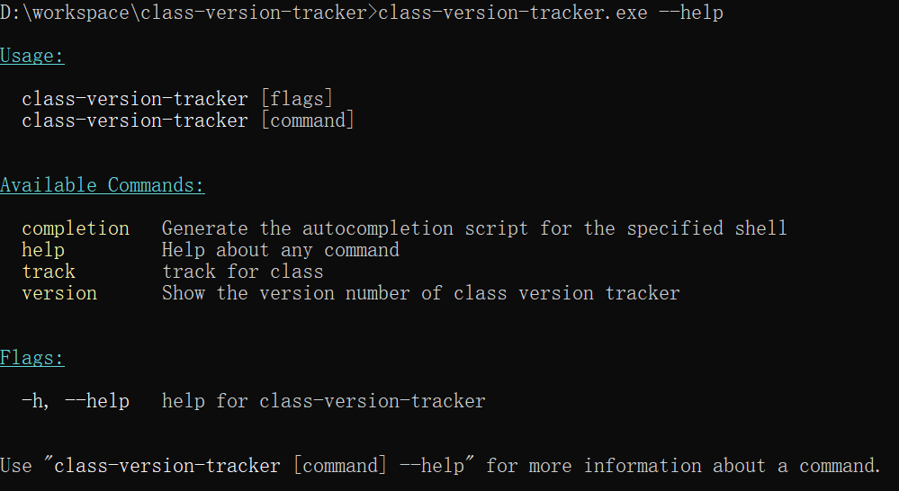
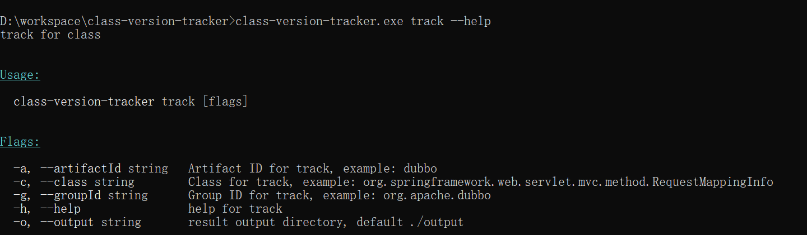
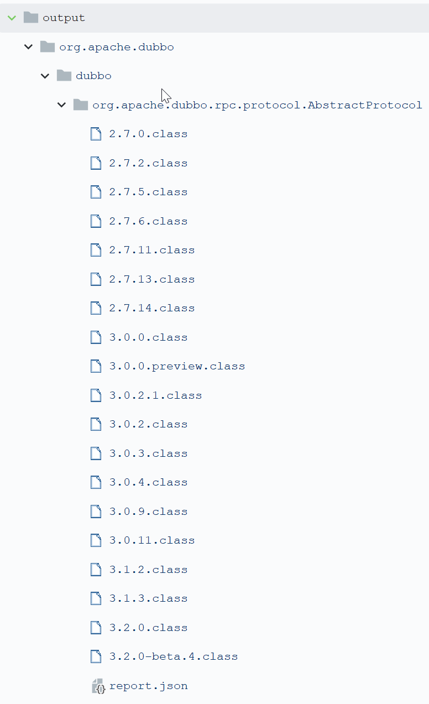

# Class Version Tracker 

# 一、这是什么？应用场景？

追踪`Maven`中央仓库中某个包的某个类的变化历史，用于在开发`Agent`类产品的时候辅助提升开发效率与质量，比如我要通过`ASM` `Hook`住`dubbo`的某个类`Foo`，但是我不知道这个`Foo`在所有的版本中都发生了哪些变化，那么我的代码可能只对其中某些版本有效，对另外一些版本就可能会`crash`，但是所有的版本太多了又不方便全部测试那会是一个很大的工作量，那么使用这个工具就能够追踪类`Foo`将类`Foo`发生变化的版本和对应的`Class`字节码找出来，只需要测试发生了变化的这些类和版本就可以了，基本上能够将工作量缩小一个数量级（属于弱辅助性工具效果有限，手头没更好的就凑活用...）。

# 二、下载安装

去`release`页面下载

# 三、使用教程

所有命令：



主要是track命令：



Usage:

```bash
class-version-tracker.exe track -g org.apache.dubbo -a dubbo -c org.apache.dubbo.rpc.protocol.DelegateExporterMap -o output
class-version-tracker.exe track -g org.apache.dubbo -a dubbo -c org.apache.dubbo.rpc.protocol.AbstractProtocol -o output
class-version-tracker.exe track -g org.apache.dubbo -a dubbo -c org.apache.dubbo.rpc.protocol.dubbo.DubboProtocol -o output
class-version-tracker.exe track -g org.apache.dubbo -a dubbo -c org.apache.dubbo.common.extension.ExtensionLoader -o output

class-version-tracker.exe track -g com.alibaba -a dubbo -c com.alibaba.dubbo.rpc.protocol.AbstractProtocol -o output
class-version-tracker.exe track -g com.alibaba -a dubbo -c com.alibaba.dubbo.common.extension.ExtensionLoader -o output
class-version-tracker.exe track -g com.alibaba -a dubbo -c com.alibaba.dubbo.rpc.protocol.dubbo.DubboProtocol -o output
```

输出结果：



会对给定的类的所有版本按照md5分组，对于每个分组，会使用当前组下的最小的版本作为文件名把类的字节码写到磁盘上，所以输出的这些带版本的class大体上是有序的。

report.json是对结果的一个概况：

```json
{
    "group_id": "org.apache.dubbo",
    "artifact_id": "dubbo",
    "class": "org.apache.dubbo.rpc.protocol.AbstractProtocol",
    "groups": [
        {
            "md5": "4053ac9260da33488adef1d98e49c562",
            "versions": [
                "2.7.0",
                "2.7.1"
            ]
        },
        {
            "md5": "9068b0f818238af2d10afd00cb7484ee",
            "versions": [
                "2.7.2",
                "2.7.3",
                "2.7.4",
                "2.7.4.1"
            ]
        },
        {
            "md5": "574c56a2c24717733216872bfe3c3bd9",
            "versions": [
                "2.7.5"
            ]
        },
        {
            "md5": "d848acbb0a65b5aef31980383b604faf",
            "versions": [
                "2.7.6",
                "2.7.7",
                "2.7.8",
                "2.7.9",
                "2.7.10"
            ]
        },
        {
            "md5": "bae923e452c3bf3f5db749f7b768398e",
            "versions": [
                "2.7.11",
                "2.7.12"
            ]
        },
        {
            "md5": "bd8bf8b79587a145f3ac056fdd3637f3",
            "versions": [
                "2.7.13",
                "2.7.15",
                "2.7.16"
            ]
        },
        {
            "md5": "fbf1e2ef3a8a84e1201754c3084fbf7b",
            "versions": [
                "2.7.14",
                "2.7.17",
                "2.7.18",
                "2.7.19",
                "2.7.20",
                "2.7.21",
                "2.7.22",
                "2.7.23"
            ]
        },
        {
            "md5": "1ac018272f188f048b3f5caf6108942b",
            "versions": [
                "3.0.0",
                "3.0.1"
            ]
        },
        {
            "md5": "5556cccc3bfc0f31ec77cd305425e8de",
            "versions": [
                "3.0.0.preview"
            ]
        },
        {
            "md5": "37ea7430282b0dc77109e3ec07f88138",
            "versions": [
                "3.0.2"
            ]
        },
        {
            "md5": "f6dfe4cf70aa970f4b6f4220e522ee9f",
            "versions": [
                "3.0.2.1"
            ]
        },
        {
            "md5": "69bb54ba4b7696b473f49668661c12b2",
            "versions": [
                "3.0.3"
            ]
        },
        {
            "md5": "8850dbc76bb42dd461cd080056358756",
            "versions": [
                "3.0.4",
                "3.0.5",
                "3.0.6",
                "3.0.7",
                "3.0.8"
            ]
        },
        {
            "md5": "2524d0620736b93113463f97858231e2",
            "versions": [
                "3.0.9",
                "3.0.10"
            ]
        },
        {
            "md5": "d45f67d3c1fcc4ef893b2ac2ca8b0578",
            "versions": [
                "3.0.11",
                "3.0.12",
                "3.0.13",
                "3.0.14",
                "3.0.15",
                "3.1.0",
                "3.1.1",
                "3.2.0-beta.1"
            ]
        },
        {
            "md5": "a50a4aa97e6d63cf764d2f6bf20b4ffa",
            "versions": [
                "3.1.2",
                "3.1.4",
                "3.1.5",
                "3.1.6",
                "3.1.7",
                "3.1.8",
                "3.1.9",
                "3.1.10",
                "3.2.0-beta.2",
                "3.2.0-beta.3"
            ]
        },
        {
            "md5": "e54c580abab3801dfa11bbfe5d6e4f4f",
            "versions": [
                "3.1.3"
            ]
        },
        {
            "md5": "b2a49097c46db20e6c25fb04a5ea6b59",
            "versions": [
                "3.2.0",
                "3.2.1",
                "3.2.2"
            ]
        },
        {
            "md5": "a8d9641f4243dc7562e4de807041f6da",
            "versions": [
                "3.2.0-beta.4",
                "3.2.0-beta.5",
                "3.2.0-beta.6"
            ]
        }
    ]
}
```

# 四、TODO

- 支持指定是使用本地mvn配置的镜像仓库还是直接连中央仓库，因为某些镜像仓库有点坑（某里），会有那种版本空洞，冷不丁给你来一下 

- 支持中央仓库之外的仓库 


